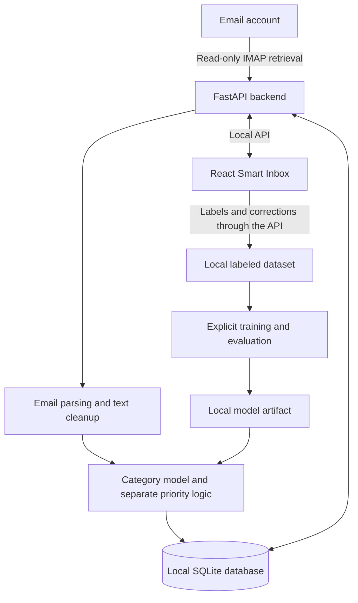

# Meiruzone

A local-first Smart Inbox that will classify email, estimate its priority, and learn from user corrections. Meiruzone aims to make email easier to review while keeping message processing, storage, and machine-learning inference on the user's computer.

## Project status

Meiruzone is currently in the planning stage. The repository contains a Python starter and project documentation; the React frontend, FastAPI backend, IMAP integration, and trained models have not been implemented yet.

Development starts with the **Open Design frontend handover**, using its design and source as the foundation. The frontend will first run with synthetic email data, followed by backend integration and the ML workflow. See the [project task list](docs/TO-DO.md) for the current delivery order and completion criteria.

## Planned MVP

- Connect an email account through IMAP and retrieve recent or unread messages.
- Parse and store the required email fields in a local SQLite database.
- Organize messages by category and a separate High, Medium, or Low priority.
- Display predictions, confidence, filters, email details, and basic statistics in a React Smart Inbox.
- Visualize category distribution in a dashboard treemap, with rectangle sizes based on email counts and category selection opening the matching inbox messages.
- Flag low-confidence predictions as **Needs Review**.
- Let users label messages, correct predictions, and retain feedback for later training.
- Train, evaluate, and run a traditional ML classifier locally.

The initial categories are **Recruitment, LinkedIn, Personal, Transaction, Newsletter, Promotion, Spam, and Other**. The taxonomy may be adjusted after inspecting labeled data.

## How the application will work



The category baseline uses **sender + subject + body → TF-IDF → Logistic Regression** to produce a category and confidence. Priority is assigned independently using simple rules or a separate baseline model. Retraining is a deliberate local operation in the MVP.

Model evaluation will include per-class precision, recall, F1, macro F1, and a confusion matrix, with held-out data to measure performance.

## Proposed technology

| Area | Planned approach |
| --- | --- |
| Frontend | React, based on the Open Design handover |
| Backend | Python and FastAPI |
| Email retrieval | IMAP |
| Local storage | SQLite |
| Machine learning | scikit-learn, TF-IDF, Logistic Regression |
| Model persistence | Local Joblib artifacts |
| Packaging | Docker and optional Docker Compose |
| Continuous integration | GitHub Actions |

These are implementation targets. The current Python project declares no application dependencies.

## Privacy and security

The MVP is designed to process and store email locally without requiring cloud infrastructure or external AI services. IMAP retrieval will use verified TLS and preserve the user's mailbox state.

Credentials must stay outside source code and the application database. Private emails, training datasets, database files, model artifacts, and secrets must be excluded from Git. The task list includes extending the starter's ignore rules before these files are introduced.

The frontend will render message content safely as plain text. API inputs will be validated, local endpoints restricted where practical, and logs sanitized to avoid exposing message bodies or credentials. These security requirements are planned work and are tracked in [TO-DO.md](docs/TO-DO.md).

## Development roadmap

1. Receive and integrate the Open Design frontend, including the dashboard treemap, with synthetic data, interaction tests, and security checks.
2. Agree the frontend/backend API contract and establish FastAPI foundations.
3. Implement local storage and safe IMAP ingestion.
4. Connect the frontend and dashboard aggregates to local data and build a human-labeled dataset.
5. Train and evaluate the category baseline.
6. Add inference, independent priority assignment, and the feedback loop.
7. Complete local packaging, reproducible setup, and CI.
8. Validate the complete MVP workflow and review security.

Frontend CI should start in the first phase and expand as backend and ML components are introduced.

## Repository structure

```text
Meiruzone/
├── app/                  # Placeholder for backend application code
├── docker/               # Placeholder for container configuration
├── docs/
│   ├── architecture.md   # Proposed system design and data flows
│   ├── client-brief.md   # Product goals, scope, and success criteria
│   └── TO-DO.md          # Frontend-first implementation checklist
├── playground/           # Placeholder for experiments and notebooks
├── .env.example          # Starter environment template
├── hello.py              # Python starter entry point
├── pyproject.toml        # Python metadata and dependencies
└── uv.lock               # Locked Python dependencies
```

The `frontend/` directory, local data storage, and model artifact directories will be added during implementation.

## Set up the current starter

Prerequisites: Git, Python 3.12 or newer, and `uv`.

```bash
git clone --branch development https://github.com/Igrise12/Meiruzone.git
cd Meiruzone
uv sync
uv run hello.py
```

This runs the Python starter. Application startup, frontend commands, and IMAP configuration instructions will be documented as those components are implemented. Do not put real credentials into tracked files.

## Testing and quality

Application test suites and CI are not configured yet. Planned checks cover:

- Frontend filtering, labeling, correction, treemap category navigation, loading/error states, accessibility, and safe content rendering.
- Dashboard category counts, percentages, human-label precedence, Unclassified messages, and refresh after sync or corrections.
- Backend input validation, persistence, API integration, and local access restrictions.
- IMAP parsing, repeatable sync, failure recovery, and unchanged mailbox state.
- ML preprocessing, saved-model loading, valid predictions, missing fields, and missing or corrupt models.
- The full ingestion-to-correction workflow using isolated storage and synthetic fixtures.
- Linting, applicable type checks, production/container builds, dependency checks, and secret scanning in CI.

See [TO-DO.md](docs/TO-DO.md) for testing and security tasks attached to each milestone.

## MVP scope boundaries

The first release will not send or reply to email, delete or move messages, replace a complete email client, or perform automatic continuous retraining. Large Transformer models, LLM features, cloud deployment, and distributed infrastructure are deferred.

Future experiments may add local LLM summaries, action items, semantic search, or low-confidence fallback after the core workflow is reliable.

## Project documentation

- [Client brief](docs/client-brief.md): intended users, product experience, MVP scope, and success criteria.
- [Architecture](docs/architecture.md): proposed components, data flows, local deployment, and constraints.
- [Task list](docs/TO-DO.md): current frontend-first delivery order, testing, security, and milestone acceptance.
