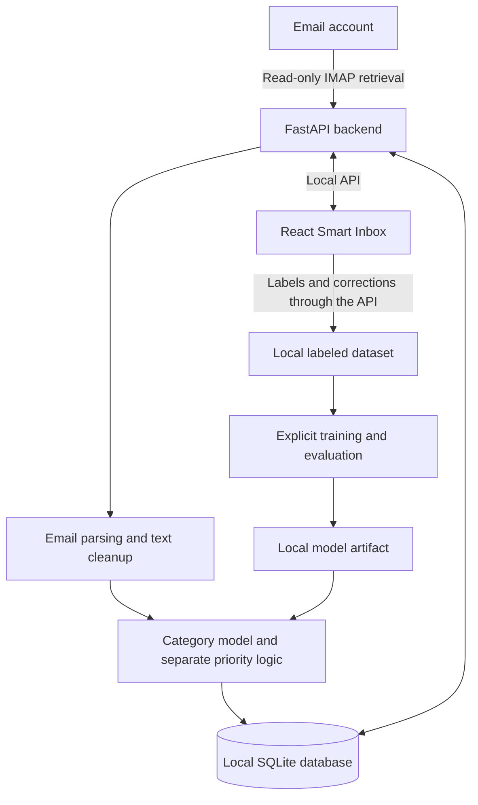

# Meiruzone

A local-first Smart Inbox that will classify email, estimate its priority, and learn from user corrections. Meiruzone aims to make email easier to review while keeping message processing, storage, and machine-learning inference on the user's computer.

## Project status

The React Smart Inbox reviews locally stored email and retains an explicit synthetic development mode. The FastAPI backend provides validated inbox, labeling, category statistics, and explicit read-only IMAP sync backed by SQLite. Tasks 1–7 are implemented, including local category training/evaluation, approved model activation, sync-time inference, independent priority rules, GitHub Actions, and local Docker Compose packaging. The frontend uses the local API by default, with an explicit offline fixture mode. Model lab displays active status and saved held-out metrics; missing or failed category predictions leave messages and manual labeling available. Follow the [delivery guide](docs/delivery.md) for repeatable setup and packaging; full MVP acceptance remains task 8.

Development starts with the **Open Design frontend handover**, using its design and source as the foundation. The frontend runs with synthetic email data, followed by backend integration and the ML workflow. See the [project task list](docs/TO-DO.md) for the current delivery order and completion criteria.

## Planned MVP

- Connect an email account through IMAP and retrieve recent or unread messages.
- Parse and store the required email fields in a local SQLite database.
- Organize messages by category and a separate High, Medium, or Low priority.
- Display predictions, confidence, filters, email details, and basic statistics in a React Smart Inbox.
- Visualize category distribution in a dashboard treemap, with rectangle sizes based on email counts and category selection opening the matching inbox messages.
- Flag low-confidence predictions as **Needs Review**.
- Let users label messages, correct predictions, and retain feedback for later training.
- Train, evaluate, and run a traditional ML classifier locally.

The initial categories are **Recruitment, LinkedIn, Personal, Transaction, Newsletter, Promotion, Spam, and Other**. The taxonomy may be adjusted after inspecting labeled data.

## How the application will work



The category baseline uses **sender + subject + body → TF-IDF → Logistic Regression** to produce a category and confidence. Priority is assigned independently using simple rules or a separate baseline model. Retraining is a deliberate local operation in the MVP.

Model evaluation includes per-class precision, recall, F1, macro F1, and a confusion matrix, with held-out data to measure performance.

## Proposed technology

| Area | Planned approach |
| --- | --- |
| Frontend | React, based on the Open Design handover |
| Backend | Python and FastAPI |
| Email retrieval | IMAPClient over verified TLS |
| Local storage | SQLite |
| Machine learning | scikit-learn, TF-IDF, Logistic Regression |
| Model persistence | Local Joblib artifacts |
| Packaging | Docker and optional Docker Compose |
| Continuous integration | GitHub Actions |

React/API integration, persistent human labeling, FastAPI, SQLite, safe IMAP ingestion, and category training/evaluation are implemented. Approved model activation, sync-time inference, and priority rules are implemented. Packaging and CI remain later milestones.

## Privacy and security

The MVP is designed to process and store email locally without requiring cloud infrastructure or external AI services. IMAP retrieval uses verified TLS, read-only folder selection, and non-marking text-part fetches to preserve mailbox state. Attachment payloads stay on the server.

Credentials stay outside source code and the application database. Ignore rules exclude private local data, databases and sidecars, datasets, models, and secrets. Only synthetic examples belong in automated tests.

The frontend renders content as escaped plain text. The backend validates API inputs, restricts Host names and browser origins to explicitly allowed local values, and requires JSON plus a local request marker for writes. Errors and application logs omit private input and exception details. The documented startup disables HTTP access logging so search queries do not appear in logs.

## Development roadmap

1. Receive and integrate the Open Design frontend, including the dashboard treemap, with synthetic data, interaction tests, and security checks.
2. Agree the frontend/backend API contract and establish FastAPI foundations.
3. Implement local storage and safe IMAP ingestion.
4. Connect the frontend and dashboard aggregates to local data and build a human-labeled dataset.
5. Train and evaluate the category baseline.
6. Add inference, independent priority assignment, and the feedback loop.
7. Complete local packaging, reproducible setup, and CI.
8. Validate the complete MVP workflow and review security.

Frontend CI should start in the first phase and expand as backend and ML components are introduced.

## Repository structure

```text
Meiruzone/
├── app/                  # FastAPI, SQLite, ingestion, shared ML helpers, training CLI
├── docker/               # Placeholder for container configuration
├── docs/
│   ├── architecture.md   # Proposed system design and data flows
│   ├── api-contract.md   # Implemented HTTP shapes and frontend adapter mapping
│   ├── client-brief.md   # Product goals, scope, and success criteria
│   └── TO-DO.md          # Frontend-first implementation checklist
├── frontend/             # Vite + React + TypeScript Smart Inbox preview
│   ├── src/              # Inbox UI, synthetic fixtures, adapter, and treemap
│   ├── tests/            # Component and aggregate tests
│   └── README.md         # Frontend setup and verification commands
├── playground/           # Placeholder for experiments and notebooks
├── tests/                # Backend and ML tests with temporary synthetic data
├── data/                 # Ignored local database; created at backend startup
├── models/               # Ignored private versioned model runs; created by training
├── .env.example          # Safe backend configuration template
├── hello.py              # Python starter entry point
├── pyproject.toml        # Python metadata and dependencies
└── uv.lock               # Locked Python dependencies
```

The backend creates local data storage on startup. Training creates the private model artifact directory only after fitting and evaluation succeed.

## Set up the backend

Prerequisites: Git, Python 3.12 or newer, and `uv`.

```bash
git clone --branch development https://github.com/Igrise12/Meiruzone.git
cd Meiruzone
uv sync
uv run uvicorn app.main:app --host 127.0.0.1 --port 8000 --no-access-log
```

Run commands from the repository root. The backend creates an empty SQLite database at `data/meiruzone.sqlite3`, without contacting a mailbox. The application schema is available at `http://127.0.0.1:8000/openapi.json`; see the [API contract](docs/api-contract.md) for examples and frontend integration. Interactive API documentation is disabled to avoid external assets. The unused starter remains runnable with `uv run hello.py`.

To exercise the API with ten synthetic messages, use a separate demo database:

```bash
MEIRUZONE_DEMO=true MEIRUZONE_DATABASE_PATH=data/demo.sqlite3 uv run uvicorn app.main:app --host 127.0.0.1 --port 8000 --no-access-log
```

Demo messages seed once in an empty database; the seeder leaves existing records alone. Corrections survive restart, and demo sync is an explicitly identified no-op. Use separate databases for demo and personal mail.

```bash
curl 'http://127.0.0.1:8000/api/v1/emails?needsReview=true&limit=10'
curl http://127.0.0.1:8000/api/v1/category-stats
curl -X PATCH http://127.0.0.1:8000/api/v1/emails/demo-01/labels \
  -H 'Content-Type: application/json' -H 'X-Meiruzone-Request: 1' \
  --data '{"category":"Personal","source":"correction"}'
curl -X POST http://127.0.0.1:8000/api/v1/sync \
  -H 'Content-Type: application/json' -H 'X-Meiruzone-Request: 1' \
  --data '{"mode":"recent","limit":50}'
```

### Local configuration

Use process environment variables, or copy the safe `.env.example` to an ignored `.env`, keep it readable only by your user, and load it explicitly:

```bash
uv run --env-file .env uvicorn app.main:app --host 127.0.0.1 --port 8000 --no-access-log
```

| Variable | Default |
| --- | --- |
| `MEIRUZONE_DATABASE_PATH` | `data/meiruzone.sqlite3` relative to the working directory |
| `MEIRUZONE_DEMO` | `false` |
| `MEIRUZONE_MODEL_DIRECTORY` | Unconfigured; exact trusted, evaluated local run directory |
| `MEIRUZONE_REVIEW_THRESHOLD` | Unset; optional numeric 0–100 override of all saved cutoffs |
| `MEIRUZONE_FRONTEND_ORIGINS` | `http://localhost:5173,http://127.0.0.1:5173` |
| `MEIRUZONE_IMAP_HOST` | Unconfigured; hostname or IP address, without a URL |
| `MEIRUZONE_IMAP_PORT` | `993`, in the range 1–65535; always implicit TLS |
| `MEIRUZONE_IMAP_USERNAME` | Unconfigured |
| `MEIRUZONE_IMAP_PASSWORD` | Unconfigured; password or provider app password |
| `MEIRUZONE_IMAP_MAILBOX` | `INBOX`; one configurable folder |

Origins must be explicit loopback origins without paths or wildcards. To allow a different frontend port, add its exact origin to the comma-separated list. IMAP host, username, and a nonempty password are all required to enable real sync. Incomplete configuration keeps local inbox access available and reports sync unavailable. Control characters in IMAP configuration are rejected; passwords are masked in settings and excluded from serialization. The account scope stores a hash of host/port/username, with no password.

SQLite files are created with user-only permissions. Schema version 3 uses `PRAGMA user_version`; transactional migrations preserve records and add scoped IMAP state plus prediction cutoffs/errors. Existing predictions receive cutoff 70. Unknown versions are refused without deleting data. Ingestion updates message fields and fills missing predictions atomically with identity/progress, preserving completed predictions and all human labels.

### Sync real mail

Copy `.env.example` to an ignored `.env`, set the provider's IMAP host, username, and password/app password, keep `MEIRUZONE_DEMO=false`, and choose a personal-mail database. Protect the file with `chmod 600 .env`, then start the backend using the `--env-file .env` command above. Startup creates/migrates local storage without contacting IMAP. Run one backend process with one Uvicorn worker per database.

Use the earlier `POST /api/v1/sync` example to retrieve up to 50 recent messages, or request `{"mode":"unread","limit":50}` for unread mail. The maximum limit is 100. Recent mode selects the highest UIDs; unread mode additionally requires UNSEEN. Both exclude messages flagged Deleted. Each sync refreshes only that newest matching window, including read state; older records remain as previously stored. Remote deletion never removes a local copy.

IMAPClient supplies parsed protocol responses and mailbox-name encoding, avoiding a custom IMAP response parser. Connections verify certificates and hostnames and use 30-second connection/read timeouts. Headers and selected MIME headers share a 64 KiB budget per message; selected encoded text payloads share a 1 MiB budget. MIME traversal is capped at depth 20 and 100 parts. Plain text is preferred over HTML alternatives. HTML conversion runs locally, ignores scripts/styles, and makes no network requests. Received time uses timezone-aware INTERNALDATE, then a valid timezone-aware Date header, then sync time. Missing sender/subject use `Unknown sender`/`(No subject)`; messages without a usable text body store an empty body. Malformed or oversized messages are skipped without fetching attachments.

Poll `GET /api/v1/sync` from another client to observe progress. The synchronous POST returns its final outcome: HTTP 200 for succeeded/partial, 503 when sync cannot proceed, and 409 for an overlapping request. `imported` counts new rows; `processed` counts successfully stored or skipped messages, and `total` is the selected UID count. Partial failures retain committed imports, so retrying safely upserts them. A restart marks an unfinished run with `sync_interrupted`. See the [API contract](docs/api-contract.md#sync) for counters and error codes. IMAPClient wire logs are suppressed even when application DEBUG logging is enabled; keep Uvicorn access logging disabled as documented.

If a folder's UIDVALIDITY changes, sync stops with `imap_uidvalidity_changed` before fetching messages. Keep the existing database and its human labels, stop the backend, set `MEIRUZONE_DATABASE_PATH` to a new unused file, and restart to import the new folder generation. Labels stay in the old database; automatic reconciliation or label transfer is outside this recovery policy. OAuth and simultaneous account/folder selection remain future capabilities.

### Local data retention, backup, and deletion

Emails and human labels are retained until you explicitly remove local data. Database files, sidecars, private `.env` files, and backups contain sensitive information. Keep private directories user-only (`0700`) and files user-only (`0600`), use encrypted storage where needed, and keep these files out of Git and shared folders. The ignore rules include SQLite files/sidecars, `/data/`, `/backups/`, and private environment files.

Stop the backend before backup or restore. For the default database, create a backup using Python's SQLite backup operation (choose a new backup filename for each run):

```bash
umask 077
mkdir -p backups
chmod 700 backups
uv run python - <<'PY'
import os
import sqlite3
from contextlib import closing
from pathlib import Path

source = Path("data/meiruzone.sqlite3").resolve()
backup = Path("backups/meiruzone-backup.sqlite3")
descriptor = os.open(backup, os.O_CREAT | os.O_EXCL | os.O_WRONLY, 0o600)
os.close(descriptor)
with closing(sqlite3.connect(source.as_uri() + "?mode=ro", uri=True)) as original:
    with closing(sqlite3.connect(backup)) as saved:
        original.backup(saved)
        assert saved.execute("PRAGMA integrity_check").fetchone() == ("ok",)
PY
```

Adjust `source` for a custom database. The exclusive create prevents overwriting an existing backup. To restore, verify the backup with `PRAGMA integrity_check`, copy it to a new unused database filename, enforce `0600` permissions, and set `MEIRUZONE_DATABASE_PATH` to that filename before starting the backend. Preserve the previous database until the restored inbox and labels have been checked. Backups preserve schema version and are migrated on startup when supported.

For complete local deletion, stop the backend and remove the configured database plus its matching `-journal`, `-wal`, and `-shm` sidecars, and any backups you choose to delete. This removes local emails and labels, leaves the provider mailbox unchanged, and creates an empty database on next startup. Later sync can import provider messages again. File removal does not guarantee forensic erasure from the underlying storage; backup copies follow their own retention.

Frontend setup commands are documented in [frontend/README.md](frontend/README.md). Offline fixture labels remain separate from SQLite; normal frontend labels are saved through the API.

## Run the Smart Inbox

Requirements: Node.js 20.19+ or 22.12+ and npm 10+. From `frontend/`:

```bash
npm install
npm run dev -- --host 127.0.0.1 --port 5173 --strictPort
```

Start the backend first, then open `http://127.0.0.1:5173`. The UI uses the local API by default for server-side filters, 50-message pages, selected details, labels, sync outcomes, and dashboard totals. Choose Recent or Unread to sync up to 50 messages. Unavailable sync does not prevent review of stored mail.

For offline synthetic development, use `VITE_DATA_SOURCE=fixtures npm run dev`. Browser fixture labels stay separate from SQLite. `VITE_API_BASE_URL` can select another loopback API ending in `/api/v1`; it never accepts remote hosts or embedded credentials. See the frontend README for production preview origin configuration.

Run `npm test`, `npm run test:integration`, `npm run lint`, `npm run typecheck`, and `npm run build`. The integration command starts its own synthetic HTTP backend and temporary SQLite database, mocks IMAP, and verifies ingestion/correction/refresh/restart persistence without accessing a personal mailbox.

### Build the labeled dataset

Open a stored message and explicitly choose category and/or priority. Missing human fields remain Not labeled; saving priority alone does not confirm a category prediction. Saves retain original predictions and use server timestamps. Unsaved edits survive failed saves and refreshes in the current browser page; save them before reloading.

Dashboard counts cover the complete database, independent of filters and pages. CSV export downloads all human labels for review, keeps predicted and confirmed columns separate, and escapes spreadsheet formulas. Its content is private local data.

Training consumes human category labels directly, without exporting personal email text:

```python
from app.config import Settings
from app.database import Repository

repository = Repository(Settings.from_env().database_path)
examples = repository.category_training_examples()
```

Each example contains id, sender, address, subject, body, confirmed category, optional priority, confirmed_at, and source. The reader excludes predictions and priority-only labels, opens SQLite read-only, and expects an initialized version 2 or 3 database. It never creates or migrates storage.

### Train and evaluate the category model

Run from the repository root after labeling stored messages:

```bash
uv run python -m app.train
```

The default database follows `MEIRUZONE_DATABASE_PATH`, or `data/meiruzone.sqlite3`. To load private environment configuration explicitly, use `uv run --env-file .env python -m app.train`. To select an existing database and a different private output directory:

```bash
uv run python -m app.train --database data/labeled.sqlite3 --output-dir models
```

Training never connects to IMAP, seeds demo messages, modifies labels, or activates a model. It reads a snapshot of confirmed categories and requires at least two categories with **10 distinct usable messages each**. Categories with fewer examples are excluded and listed separately from missing categories; the model can predict only its supported categories. Ten examples is a minimum readiness check, not evidence of model quality. The seeded demo database alone does not contain enough labels.

Sender name/address, subject, and body share Unicode NFKC, case, and whitespace normalization in the saved pipeline. Missing fields become empty strings; invalid field types stop training with sanitized errors. Messages with no TF-IDF word tokens are excluded. Identical normalized messages collapse to one example, while conflicting labels for identical messages stop training for correction. Similar templates and threads are not grouped and can still inflate evaluation results.

Distinct examples are ordered by normalized content and split with seed `42`: approximately **60% training, 20% validation, and 20% test**, stratified by category. Integer rounding can slightly change proportions. Complete normalization → default TF-IDF (no stop words) → Logistic Regression pipelines fit only the training split. Validation macro F1 selects `C` from `0.1`, `1`, and `10`, favoring smaller `C` on ties. The selected fitted pipeline is retained without refitting validation or test examples.

Confidence is the maximum class probability × 100. Validation selects the lowest observed cutoff with at least five accepted examples and **90% or greater accuracy**. Confidence equal to the cutoff is accepted; lower confidence needs review. A null `review_threshold` means **review all**, including scores of 100. Validation is reused for parameter and cutoff selection, so small datasets have uncertain estimates. Probabilities are uncalibrated, and reaching the validation target does not guarantee future accuracy.

The test split is evaluated once after the model and cutoff are frozen. Console output and `evaluation.json` contain aggregate class counts, unsupported categories, per-class precision/recall/F1/support, macro F1, a confusion matrix (rows are actual classes; columns are predicted classes in `supported_classes` order), and validation/test accepted accuracy and coverage. Accuracy/coverage are fractions from 0–1; confidence/cutoff use 0–100. No message text, addresses, message IDs, or credentials are included in the report.

Each successful run creates `models/category-<UTC timestamp>-<unique suffix>/` with `model.joblib` and `evaluation.json`. Both files publish together after a load check, using directory permissions `0700` and file permissions `0600`. Failures preserve previous versions. Artifacts bundle the fitted pipeline, label ordering, evaluation metadata, preprocessing/artifact versions, split counts, parameters, cutoff, and Python/scikit-learn/NumPy/SciPy/Joblib versions. Repeating a run with unchanged content, labels, and environment reproduces splits and metrics; run IDs and timestamps are new.

Treat both files as private. A fitted TF-IDF vocabulary can contain private email terms even though the evaluation report contains only aggregates. The default `/models/` directory and Joblib files are ignored by Git. If choosing another output directory, add it to your ignore rules before training so its JSON reports also remain private. Include model runs in protected local backups if needed; remove their version directories explicitly when deleting local data.

Load a specific run only when you trust its local origin:

```python
from pathlib import Path
from app.ml import load_model, predict_category

# Replace this with the exact run directory printed by your training command.
model = load_model(Path("models/category-<UTC timestamp>-<unique suffix>"))
prediction = predict_category(model, {
    "sender": "Example Hiring", "address": "hiring@example.test",
    "subject": "Interview invitation", "body": "Please confirm your interview time.",
})
print(prediction.category, prediction.confidence)
```

This helper returns category, confidence, model version, and the saved review cutoff, with priority and prediction time unset. It rejects messages with no usable text. Loading checks format, preprocessing version, class ordering, fitted pipeline, and exact recorded environment versions; missing, corrupt, or incompatible runs produce sanitized errors. Retrain after an incompatible environment change. Joblib loading can execute code: metadata validation does **not** establish trust. Never load an untrusted download or uploaded model. See [scikit-learn's persistence guidance](https://scikit-learn.org/stable/model_persistence.html). The backend uses this trusted loader during startup when a model directory is configured; see the activation workflow below.

### Activate and serve category predictions

1. Accumulate confirmed category corrections in the Smart Inbox. Priority-only labels and predictions never become category ground truth.
2. Run `uv run --env-file .env python -m app.train` (or omit `--env-file` when using process configuration). Training evaluates and saves a new private version without changing the active model or database.
3. Inspect the printed aggregate evaluation and saved `evaluation.json`: supported/missing classes, per-class metrics, macro F1, confusion matrix, sample counts, review coverage/accuracy, and limitations. Deliberately approve a suitable run; activation is not automatic and no fixed score guarantees quality.
4. Set `MEIRUZONE_MODEL_DIRECTORY` in your private `.env` to that exact locally trained run directory. Remove an existing `MEIRUZONE_REVIEW_THRESHOLD=70` assignment to use validated model cutoffs; keep a numeric override only if intentionally desired.
5. Stop and restart the single backend process with the documented startup command, then inspect Model lab or `GET /api/v1/model`. Only trust artifacts you created locally: Joblib loading can execute code. No file watching, uploads, or automatic model selection occurs.
6. Sync recent/unread messages. New messages and selected messages missing a category prediction use the active model; category failures are retried on a later sync. Missing priority is filled independently. Completed predictions, including their original version/cutoff/time, remain intact on repeat sync, even after selecting a replacement or updating message text. Other stored messages are untouched; there is no backfill command.

Each prediction retains its model's validation cutoff. Numeric cutoffs accept equal confidence; lower confidence needs review. Null cutoffs review all unconfirmed category predictions, including confidence 100. An explicit numeric `MEIRUZONE_REVIEW_THRESHOLD` overrides every stored cutoff, including review-all, without changing saved values. Removing the override restores saved behavior. Human categories suppress Needs Review; priority-only labels do not. Missing categories/confidence remain outside Needs Review and show their own status.

A missing, corrupt, or incompatible selected run reports unconfigured/invalid status without stopping inbox access or sync. New mail still receives priority, with `categoryError=model_unavailable`; failed per-message category inference records `inference_failed`. These errors do not count as IMAP skips or failed sync. Messages, identity, predictions, and progress commit together. Errors omit private exception details and content. Model lab shows only validated aggregate held-out metrics in saved class order, never paths, vocabulary, or raw training examples. Demo mode ignores model selection and keeps illustrative predictions separate from evaluated models.

### Independent priority rules

`priority-rules-v1` uses NFKC/case/whitespace-normalized subject and body only, matching whole words or phrases independently of category, confidence, read state, and attachment presence:

| Priority | English signals | Indonesian signals |
| --- | --- | --- |
| High | urgent, asap, action required, reply today, due today, due tomorrow, deadline | mendesak, segera, perlu tindakan, balas hari ini, jatuh tempo hari ini, jatuh tempo besok, tenggat |
| Low | newsletter, unsubscribe, fyi, no action required | buletin, berhenti berlangganan, sekadar informasi, tidak perlu tindakan |
| Medium | No High/Low signal | No High/Low signal |

High takes precedence over Low. The recognized negations “no action required” and “tidak perlu tindakan” are removed before matching High. Each result saves a short fixed explanation identifying the rule version; priority-only predictions use that version in `modelVersion`. These are simple text cues, not calendar/deadline parsing: quoted text and other negations can cause false positives. Confirmed human priority remains authoritative, and existing predicted priority is not recalculated during sync.

## Testing and quality

See the [delivery guide](docs/delivery.md) for clean-clone setup, local Docker Compose, GitHub Actions, security checks, and versioned source releases.

Run backend checks from the repository root:

```bash
uv run python -m unittest discover -s tests
uv run --locked ruff check .
uv run --locked mypy
uv lock --check
```

Backend tests use temporary SQLite files and synthetic messages, covering API validation, access restrictions, migration rollback, MIME parsing, selective IMAP fetches, TLS/timeouts, deduplication, interrupted/concurrent sync, retained labels/predictions, and sanitized errors/debug logs. ML checks cover preprocessing, insufficient labels, duplicate conflicts, stratification, held-out vocabulary isolation, thresholds, private/atomic artifacts, corrupt or incompatible models, safe CLI output, and fresh-process predictions. No personal mailbox or credentials are needed. Run ML checks alone with `uv run python -m unittest discover -s tests -p test_ml.py`. Frontend and HTTP integration checks are listed above. Remaining delivery and acceptance checks include:

- Frontend filtering, labeling, correction, treemap category navigation, loading/error states, accessibility, and safe content rendering.
- Dashboard category counts, percentages, human-label precedence, Unclassified messages, and refresh after sync or corrections.
- Backend input validation, persistence, API integration, and local access restrictions.
- ML preprocessing, saved-model loading, valid predictions, missing fields, and missing or corrupt models.
- The full ingestion-to-correction workflow using isolated storage and synthetic fixtures.
- Linting, focused Python/TypeScript checks, production/container builds, dependency audits, and redacted secret scanning are configured in CI; see the delivery guide for local commands.

See [TO-DO.md](docs/TO-DO.md) for testing and security tasks attached to each milestone.

## MVP scope boundaries

The first release will not send or reply to email, delete or move messages, replace a complete email client, or perform automatic continuous retraining. Large Transformer models, LLM features, cloud deployment, and distributed infrastructure are deferred.

Future experiments may add local LLM summaries, action items, semantic search, or low-confidence fallback after the core workflow is reliable.

## Project documentation

- [Client brief](docs/client-brief.md): intended users, product experience, MVP scope, and success criteria.
- [Architecture](docs/architecture.md): proposed components, data flows, local deployment, and constraints.
- [API contract](docs/api-contract.md): implemented endpoints, validation, and frontend integration.
- [Task list](docs/TO-DO.md): current frontend-first delivery order, testing, security, and milestone acceptance.
