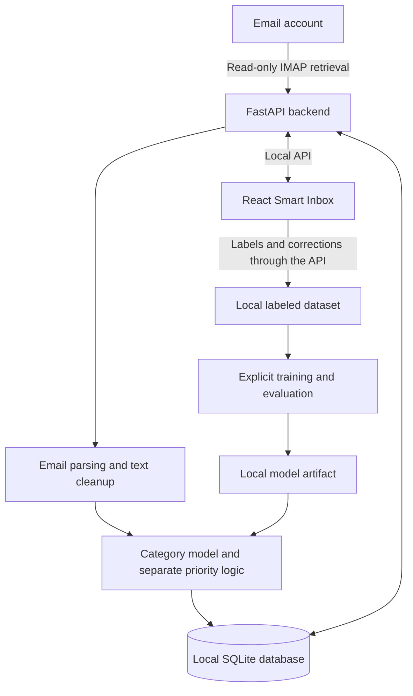

# Meiruzone

A local-first Smart Inbox that will classify email, estimate its priority, and learn from user corrections. Meiruzone aims to make email easier to review while keeping message processing, storage, and machine-learning inference on the user's computer.

## Project status

The React Smart Inbox runs locally with synthetic email data. The FastAPI backend now provides validated inbox, labeling, category statistics, and sync-status APIs backed by SQLite. The frontend still uses its fixture adapter; real IMAP retrieval, frontend integration, and trained models remain planned work.

Development starts with the **Open Design frontend handover**, using its design and source as the foundation. The frontend runs with synthetic email data, followed by backend integration and the ML workflow. See the [project task list](docs/TO-DO.md) for the current delivery order and completion criteria.

## Planned MVP

- Connect an email account through IMAP and retrieve recent or unread messages.
- Parse and store the required email fields in a local SQLite database.
- Organize messages by category and a separate High, Medium, or Low priority.
- Display predictions, confidence, filters, email details, and basic statistics in a React Smart Inbox.
- Visualize category distribution in a dashboard treemap, with rectangle sizes based on email counts and category selection opening the matching inbox messages.
- Flag low-confidence predictions as **Needs Review**.
- Let users label messages, correct predictions, and retain feedback for later training.
- Train, evaluate, and run a traditional ML classifier locally.

The initial categories are **Recruitment, LinkedIn, Personal, Transaction, Newsletter, Promotion, Spam, and Other**. The taxonomy may be adjusted after inspecting labeled data.

## How the application will work



The category baseline uses **sender + subject + body → TF-IDF → Logistic Regression** to produce a category and confidence. Priority is assigned independently using simple rules or a separate baseline model. Retraining is a deliberate local operation in the MVP.

Model evaluation will include per-class precision, recall, F1, macro F1, and a confusion matrix, with held-out data to measure performance.

## Proposed technology

| Area | Planned approach |
| --- | --- |
| Frontend | React, based on the Open Design handover |
| Backend | Python and FastAPI |
| Email retrieval | IMAP |
| Local storage | SQLite |
| Machine learning | scikit-learn, TF-IDF, Logistic Regression |
| Model persistence | Local Joblib artifacts |
| Packaging | Docker and optional Docker Compose |
| Continuous integration | GitHub Actions |

React, FastAPI, and SQLite are implemented foundations. IMAP, machine learning, packaging, and CI remain later milestones.

## Privacy and security

The MVP is designed to process and store email locally without requiring cloud infrastructure or external AI services. IMAP retrieval will use verified TLS and preserve the user's mailbox state.

Credentials stay outside source code and the application database. Ignore rules exclude private local data, databases and sidecars, datasets, models, and secrets. Only synthetic examples belong in automated tests.

The frontend renders content as escaped plain text. The backend validates API inputs, restricts Host names and browser origins to explicitly allowed local values, and requires JSON plus a local request marker for writes. Errors and application logs omit private input and exception details. The documented startup disables HTTP access logging so search queries do not appear in logs.

## Development roadmap

1. Receive and integrate the Open Design frontend, including the dashboard treemap, with synthetic data, interaction tests, and security checks.
2. Agree the frontend/backend API contract and establish FastAPI foundations.
3. Implement local storage and safe IMAP ingestion.
4. Connect the frontend and dashboard aggregates to local data and build a human-labeled dataset.
5. Train and evaluate the category baseline.
6. Add inference, independent priority assignment, and the feedback loop.
7. Complete local packaging, reproducible setup, and CI.
8. Validate the complete MVP workflow and review security.

Frontend CI should start in the first phase and expand as backend and ML components are introduced.

## Repository structure

```text
Meiruzone/
├── app/                  # FastAPI routes, models, services, SQLite, configuration
├── docker/               # Placeholder for container configuration
├── docs/
│   ├── architecture.md   # Proposed system design and data flows
│   ├── api-contract.md   # Implemented HTTP shapes and frontend adapter mapping
│   ├── client-brief.md   # Product goals, scope, and success criteria
│   └── TO-DO.md          # Frontend-first implementation checklist
├── frontend/             # Vite + React + TypeScript Smart Inbox preview
│   ├── src/              # Inbox UI, synthetic fixtures, adapter, and treemap
│   ├── tests/            # Component and aggregate tests
│   └── README.md         # Frontend setup and verification commands
├── playground/           # Placeholder for experiments and notebooks
├── tests/                # Backend API/storage tests with temporary synthetic data
├── data/                 # Ignored local database; created at backend startup
├── .env.example          # Safe backend configuration template
├── hello.py              # Python starter entry point
├── pyproject.toml        # Python metadata and dependencies
└── uv.lock               # Locked Python dependencies
```

Local data storage and model artifact directories will be added during later implementation.

## Set up the backend

Prerequisites: Git, Python 3.12 or newer, and `uv`.

```bash
git clone --branch development https://github.com/Igrise12/Meiruzone.git
cd Meiruzone
uv sync
uv run uvicorn app.main:app --host 127.0.0.1 --port 8000 --no-access-log
```

Run commands from the repository root. The backend creates an empty SQLite database at `data/meiruzone.sqlite3`, without contacting a mailbox. The application schema is available at `http://127.0.0.1:8000/openapi.json`; see the [API contract](docs/api-contract.md) for examples and the task 4 frontend mapping. Interactive API documentation is disabled to avoid external assets. The unused starter remains runnable with `uv run hello.py`.

To exercise the API with ten synthetic messages, use a separate demo database:

```bash
MEIRUZONE_DEMO=true MEIRUZONE_DATABASE_PATH=data/demo.sqlite3 uv run uvicorn app.main:app --host 127.0.0.1 --port 8000 --no-access-log
```

Demo messages seed once in an empty database. Existing records are never overwritten or mixed with demo data. Corrections survive restart, and demo sync is an explicitly identified no-op. Keep demo and future personal-mail databases separate.

```bash
curl 'http://127.0.0.1:8000/api/v1/emails?needsReview=true&limit=10'
curl http://127.0.0.1:8000/api/v1/category-stats
curl -X PATCH http://127.0.0.1:8000/api/v1/emails/demo-01/labels \
  -H 'Content-Type: application/json' -H 'X-Meiruzone-Request: 1' \
  --data '{"category":"Personal","source":"correction"}'
curl -X POST http://127.0.0.1:8000/api/v1/sync \
  -H 'Content-Type: application/json' -H 'X-Meiruzone-Request: 1' \
  --data '{"mode":"recent","limit":50}'
```

### Local configuration

Use process environment variables, or copy the safe `.env.example` to an ignored `.env`, keep it readable only by your user, and load it explicitly:

```bash
uv run --env-file .env uvicorn app.main:app --host 127.0.0.1 --port 8000 --no-access-log
```

| Variable | Default |
| --- | --- |
| `MEIRUZONE_DATABASE_PATH` | `data/meiruzone.sqlite3` relative to the working directory |
| `MEIRUZONE_DEMO` | `false` |
| `MEIRUZONE_REVIEW_THRESHOLD` | `70`, in the range 0–100 |
| `MEIRUZONE_FRONTEND_ORIGINS` | `http://localhost:5173,http://127.0.0.1:5173` |

Origins must be explicit loopback origins without paths or wildcards. To allow a different frontend port, add its exact origin to the comma-separated list. Mailbox credentials are reserved backend-only environment variables documented in the template; the current application does not read them or connect to IMAP. Future IMAP code will consume process secrets directly, without storing passwords in SQLite or exposing them through APIs.

SQLite files are created with user-only permissions. Schema version 1 uses `PRAGMA user_version`; startup creates a new schema transactionally and refuses unsupported versions without deleting data. Add a numbered transactional migration before changing this schema. Current predictions and human labels occupy separate tables; future ingestion must preserve labels. No ORM, scheduler, or distributed service is required.

Frontend setup commands are documented in [frontend/README.md](frontend/README.md). Its browser-stored demo labels remain separate from SQLite.

## Run the frontend preview

Requirements: Node.js 20.19+ or 22.12+ and npm 10+. From `frontend/`:

```bash
npm install
npm run dev
```

Vite prints the local preview URL. Check the frontend with `npm test`, `npm run lint`, `npm run typecheck`, and `npm run build`. The demo does not connect to a mailbox; confirmed labels stay in browser local storage.

## Testing and quality

Run backend checks from the repository root:

```bash
uv run python -m unittest discover -s tests
uv lock --check
```

Backend tests use temporary SQLite files and synthetic messages, covering filtering, pagination, labels, preserved predictions, restart persistence, aggregate counts, sync modes, invalid requests, local access restrictions, and sanitized failures. Frontend checks are listed above. CI and the remaining IMAP/ML checks are planned:

- Frontend filtering, labeling, correction, treemap category navigation, loading/error states, accessibility, and safe content rendering.
- Dashboard category counts, percentages, human-label precedence, Unclassified messages, and refresh after sync or corrections.
- Backend input validation, persistence, API integration, and local access restrictions.
- IMAP parsing, repeatable sync, failure recovery, and unchanged mailbox state.
- ML preprocessing, saved-model loading, valid predictions, missing fields, and missing or corrupt models.
- The full ingestion-to-correction workflow using isolated storage and synthetic fixtures.
- Linting, applicable type checks, production/container builds, dependency checks, and secret scanning in CI.

See [TO-DO.md](docs/TO-DO.md) for testing and security tasks attached to each milestone.

## MVP scope boundaries

The first release will not send or reply to email, delete or move messages, replace a complete email client, or perform automatic continuous retraining. Large Transformer models, LLM features, cloud deployment, and distributed infrastructure are deferred.

Future experiments may add local LLM summaries, action items, semantic search, or low-confidence fallback after the core workflow is reliable.

## Project documentation

- [Client brief](docs/client-brief.md): intended users, product experience, MVP scope, and success criteria.
- [Architecture](docs/architecture.md): proposed components, data flows, local deployment, and constraints.
- [API contract](docs/api-contract.md): implemented endpoints, examples, validation, and frontend mapping.
- [Task list](docs/TO-DO.md): current frontend-first delivery order, testing, security, and milestone acceptance.
