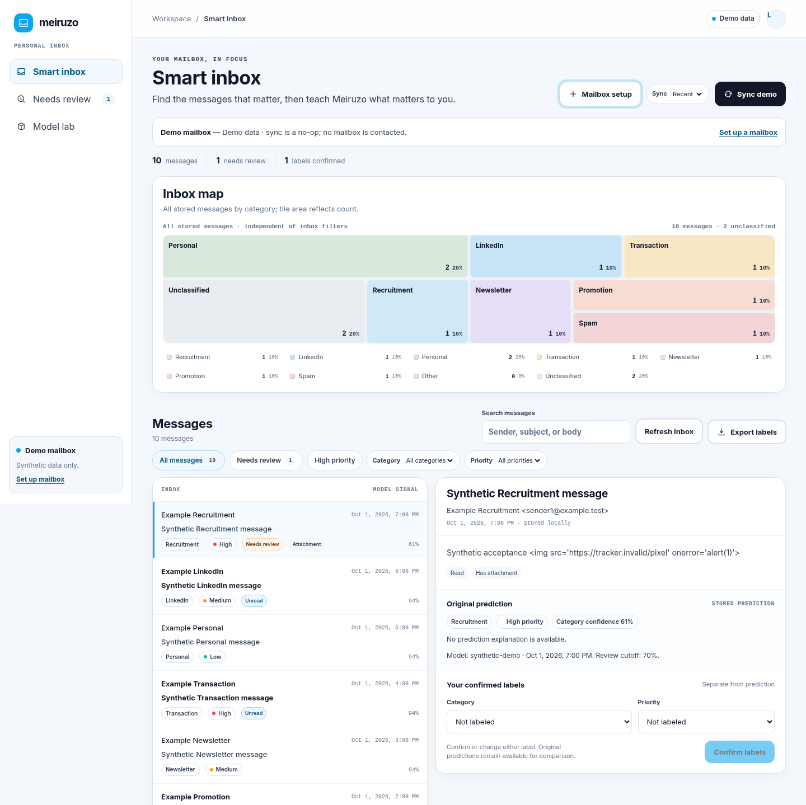

# How to use Meiruzone

Meiruzone is a local Smart Inbox for organizing email by category and priority. It retrieves messages through IMAP, stores working copies on your computer, and learns categories from labels you confirm. It does not send, reply to, move, delete, or mark messages as read in your provider mailbox.

Start with the demo to learn the interface, then connect your account and build a labeled dataset. The complete workflow is:

**Sync → review → confirm labels → train → evaluate → activate → sync → correct → retrain.**

## 1. Start the app from source

These commands use Linux/Bash. You need the project checkout, Python 3.12, uv 0.12.21, Node.js 24, and npm. Run commands from the project root unless a step says otherwise. Installation downloads dependencies; normal use needs the local app and IMAP access when you sync.

Install the locked dependencies:

```bash
uv sync --locked
cd frontend
npm ci
cd ..
```

For a first look without an email account, start the demo backend in **terminal 1**, from the project root:

```bash
MEIRUZONE_DEMO=true MEIRUZONE_DATABASE_PATH=data/demo.sqlite3 \
  uv run --locked uvicorn app.main:app --host 127.0.0.1 --port 8001 --no-access-log
```

Start the frontend in **terminal 2**, also beginning at the project root:

```bash
cd frontend
npm run dev -- --host 127.0.0.1 --port 5173 --strictPort
```

Open [the app](http://127.0.0.1:5173). Leave both terminals running while you use it.

You should see **Demo data** and synthetic messages. Try selecting a message, filtering categories, and saving a label. Demo labels persist in `data/demo.sqlite3`. **Sync demo** does not contact a mailbox, and demo predictions are illustrative rather than an evaluated model. The ten demo messages are insufficient for training.

Press **Ctrl+C** in terminal 1 before switching to the real-mail backend below. Keep the frontend running. Run only one backend against a database at a time. For container startup instead, see [Run with Docker](#8-run-with-docker-instead).

## 2. Connect your email account

The **Mailbox setup** button explains configuration; it does not collect or save passwords. Configure the backend through a private `.env` file.

From the project root, create the file if it does not already exist:

```bash
umask 077
if [ ! -e .env ]; then
  cp .env.example .env
fi
chmod 600 .env
```

Edit `.env` locally. Keep its other defaults, set the following values, and remove the leading `#` from any setting you enable. The host and username below are placeholders; enter the values supplied by your email provider and a nonempty password or provider app password.

```dotenv
MEIRUZONE_DATABASE_PATH=data/inbox.sqlite3
MEIRUZONE_DEMO=false
MEIRUZONE_IMAP_HOST=imap.your-provider.example
MEIRUZONE_IMAP_PORT=993
MEIRUZONE_IMAP_USERNAME=you@example.test
MEIRUZONE_IMAP_PASSWORD=
MEIRUZONE_IMAP_MAILBOX=INBOX
```

Use the provider's IMAP hostname, without `https://` or another URL prefix. This app uses verified implicit TLS, normally on port 993. It supports one account and one folder per backend configuration. Keep the real-mail database separate from the demo database.

Start the backend in terminal 1, from the project root:

```bash
uv run --locked --env-file .env uvicorn app.main:app \
  --host 127.0.0.1 --port 8001 --no-access-log
```

Reload the app. It should show **Local data**. The inbox starts empty until you sync, and **Sync inbox** becomes available when host, username, and password are configured. Restart the backend after changing `.env`; the frontend alone cannot apply backend configuration changes.

Keep credentials in the private backend configuration. Do not put them in frontend settings, browser storage, screenshots, or Git.

## 3. Sync and navigate the Smart Inbox

1. Choose **Recent** or **Unread** in the **Sync** selector.
2. Click **Sync inbox** and wait for the status to finish.
3. Select a message to open its locally stored text and prediction details. On mobile, use **Back to messages** to return to the list.

Each UI sync retrieves up to **50 matching messages**. Recent chooses the highest message UIDs; Unread limits those results to messages the provider marks unread. Both exclude deleted messages. Repeating a sync updates already imported messages without creating duplicates. This is a bounded inbox companion, so repeatedly pressing Sync does not progressively import the entire historical mailbox.

Sync retrieves message text and attachment presence, not attachment payloads. Opening a message does not change its read state on the server. The app displays safe plain text rather than the original HTML layout or remote images.

Use these controls to find messages:

| Control | What it does |
| --- | --- |
| Search messages | Searches stored sender, subject, and body text |
| Category / Priority | Combines filters for a topic and urgency level |
| Needs review | Shows unconfirmed category predictions that require review |
| High priority | Filters messages with an effective High priority |
| Previous / Next | Moves through 50-message pages of matching results |
| Clear filters | Returns to the full inbox |
| Refresh inbox | Reloads local messages, labels, and counts; it does not fetch new mail through IMAP |

The **Inbox map** covers all locally stored messages, independently of filters and pages. Larger rectangles mean more messages. Select a tile or an entry in the category-count list to filter the inbox. Human category labels take precedence over predictions; messages with neither appear as **Unclassified**.

Example Smart Inbox with synthetic data:



## 4. Confirm labels and correct predictions

Select a message and inspect **Original prediction**, then use **Your confirmed labels**:

1. Choose a category, a priority, or both.
2. Click **Confirm labels**, or **Update labels** if a label is already saved.
3. Wait for **Your labels are saved on this device.** The inbox and category counts refresh.

Categories are Recruitment, LinkedIn, Personal, Transaction, Newsletter, Promotion, Spam, and Other. **Other** is a deliberate label; **Unclassified** means no category label or prediction exists.

Priority is independently High, Medium, or Low. A Recruitment message can be Low priority, and a Transaction message can be High. Automatic priority uses simple English/Indonesian text rules; you can correct it independently of the category model.

Choosing priority alone does **not** confirm the predicted category. To accept a category prediction as training ground truth, explicitly choose that category and save it. Your saved labels control the effective category/priority while **Original prediction**, its confidence, and its model version remain available for comparison. Saved labels can be changed, but cannot currently be cleared back to Not labeled.

Save edits before reloading or closing the page. Unsaved drafts survive message selection and refresh within the current page session, but not a browser reload. A failed save keeps the draft available so you can retry.

### Understand Needs Review

Needs Review depends on the saved model cutoff and whether you have confirmed a category. A prediction below its numeric cutoff needs review; equality is accepted. If the model has no reliable cutoff, all unconfirmed category predictions need review, including a displayed confidence of 100%.

Confirming a category removes that message from Needs Review; confirming priority alone does not. Messages without a category prediction are outside this view—find them under **Unclassified**. Confidence describes the original model prediction, not your saved correction, and is not a guarantee of correctness.

## 5. Train, evaluate, and activate a category model

Training runs in a terminal. **Model lab** displays model status and saved evaluation; it does not start training.

### Label enough examples

Confirm at least **ten distinct usable messages in each of at least two categories**. Twenty labels in a single category are insufficient. More varied examples are preferable; ten per category is only the minimum needed to begin. Priority-only labels and unconfirmed predictions are not category training examples. Exact duplicate messages count once; conflicting labels on identical normalized text stop training.

### Train from your local database

For a source installation, run this from the project root after labeling messages:

```bash
uv run --locked --env-file .env python -m app.train
```

It reads the database selected in `.env`, evaluates the model, and prints the path of a new run under `models/`. It does not contact IMAP, modify your messages, or activate the new model. If you run the app in containers, use [the Docker training command](#train-and-activate-in-docker) instead so training and serving share the same runtime.

Review the printed results or the run's `evaluation.json`:

| Result | How to use it |
| --- | --- |
| Supported / missing categories | Only supported categories can be predicted by this model |
| Per-category precision, recall, and F1 | Look for categories the model often confuses or misses |
| Macro F1 | Summarizes F1 while giving each supported category equal weight |
| Confusion matrix | Rows are actual categories; columns are predictions, in the saved category order |
| Review cutoff, coverage, and accepted accuracy | Shows how much mail will need review and the observed held-out results |

Scores range from 0 to 1; displayed confidence and cutoffs range from 0 to 100%. Small datasets and similar message templates can produce optimistic scores. Review sample counts and weak categories before selecting a run.

### Activate the run

1. Set `MEIRUZONE_MODEL_DIRECTORY` in `.env` to the **exact run directory printed by training**. For example, replace the placeholder in `MEIRUZONE_MODEL_DIRECTORY=models/category-<run>` with your actual run name.
2. Leave `MEIRUZONE_REVIEW_THRESHOLD` commented out to use the model's saved cutoffs. Set a numeric override only if you deliberately want to replace that review policy.
3. Stop the backend with Ctrl+C and restart it using the real-mail startup command in section 2.
4. Refresh the inbox or reload the page, then open **Model lab** and check the active version, supported categories, and evaluation.
5. Run **Sync inbox**. New messages and selected messages missing category predictions use the active model. Stored messages outside the sync selection are untouched.

Only load models you trained locally and trust. Model files can contain private email vocabulary and must stay private.

### Improve the model later

Correct predictions in the inbox, then repeat training, evaluation, and explicit activation. Retraining does not automatically replace the active model. Switching models does not overwrite completed predictions or saved human labels, and there is no automatic backfill of the entire inbox.

## 6. Export labels and keep your data

Click **Export labels** to download a CSV of all saved human labels, including those outside the current filters or page. Predicted and confirmed values occupy separate columns. Export is disabled while a known sync is running.

The CSV includes sender and subject information and is private. It contains no message bodies, is not a full backup, and is not the input to the training command; training reads SQLite directly.

Saved mail and labels remain in the configured SQLite file. Trained runs remain under `models/`. Keep both private, and follow the [backup and restore instructions](../README.md#local-data-retention-backup-and-deletion) before replacing storage or changing environments.

## 7. Stop and start again

For a source installation, press Ctrl+C in each running terminal. Restart the backend from the same project root with the same `.env`, then restart the frontend using the commands above. Saved labels, local messages, and selected model artifacts persist. Unsaved browser edits do not.

Normal review uses local data. The app contacts the mailbox when you explicitly click **Sync inbox**; periodic automatic sync is not enabled.

## 8. Run with Docker instead

Use this path instead of running the source backend/frontend. You need Docker Engine and Docker Compose 2.24+ on Linux, plus permission to use Docker. The container images provide the application runtimes; host Python/Node installations are unnecessary for this path. These commands assume the default host `data/` and `models/` directories.

Create the private `.env` as described in section 2, then run from the project root as your ordinary user:

```bash
umask 077
mkdir -p data models
chmod 700 data models
export MEIRUZONE_UID="$(id -u)"
export MEIRUZONE_GID="$(id -g)"
docker compose up --build --detach --wait
```

Open [the app](http://127.0.0.1:5173). Save your numeric UID/GID in `.env` for later sessions if they differ from the template values. The data/model directories must be owned by that user. For a container demo, set `MEIRUZONE_DEMO=true` and `MEIRUZONE_DATABASE_PATH=data/demo.sqlite3` in `.env`; restore the real-mail settings before connecting your account.

### Train and activate in Docker

After confirming labels, give the one-off training command writable access to the model directory:

```bash
docker compose run --rm --no-deps \
  --volume "$PWD/models:/app/models:rw" \
  backend python -m app.train
```

Review the saved evaluation, set the exact `MEIRUZONE_MODEL_DIRECTORY=models/category-<run>` in `.env`, and recreate the services to apply configuration:

```bash
docker compose up --detach --force-recreate --wait
```

The normal serving model mount remains read-only. Use `data/...` and `models/...` paths inside the container configuration; host absolute paths do not refer to the same files inside a container. For custom mount directories or ports, see [the delivery guide](delivery.md#docker-compose-startup).

Reload the app, check the active version in **Model lab**, then sync to use it for new/missing category predictions.

Stop the containers with:

```bash
docker compose down
```

Your host-mounted messages, labels, and models remain intact.

## 9. Troubleshooting

| What you see | What to do |
| --- | --- |
| Sync inbox is disabled | Check that demo is false and host, username, and a nonempty password are set in the backend configuration. Restart/recreate the backend. |
| The app shows Demo data | Stop the demo backend, start the real-mail command with `.env`, and reload. Keep demo and real databases separate. |
| Inbox unavailable | Confirm the backend is running, then use Retry inbox. Keep both source terminals running. |
| No messages here | Clear search/category/priority/review filters. Refresh reloads local mail; Sync retrieves mail from the provider. |
| Sync needs attention or partial results | Read the status, check provider settings/connectivity, and retry after the current run finishes. Already saved messages remain available. |
| Category unavailable | Sync and manual labels still work. Train/select a trusted model, restart, and sync again to retry missing predictions. |
| Labels could not be saved | Keep the page open and retry; the draft remains available. Do not reload before saving. |
| Training requests more labels | Confirm categories for ten distinct usable messages in each of two categories. Check for duplicates, empty text, or priority-only labels. |
| Selected model could not be loaded | Check the exact run path and train/serve runtime compatibility. Retrain after incompatible dependency/runtime changes. |
| The prediction still shows the old category after correction | This is expected: Original prediction is retained. Your confirmed label controls filtering and category totals. |
| Unclassified messages do not appear in Needs Review | Needs Review requires a category prediction; use the Unclassified category to label these messages. |
| Startup reports a port or origin problem | Stop another local instance or follow the delivery guide for matching loopback ports and frontend origins. |

The [delivery guide](delivery.md) covers advanced configuration and verification. The [acceptance report](acceptance.md) records tested behavior and the remaining live-account/original-design acceptance gates.
